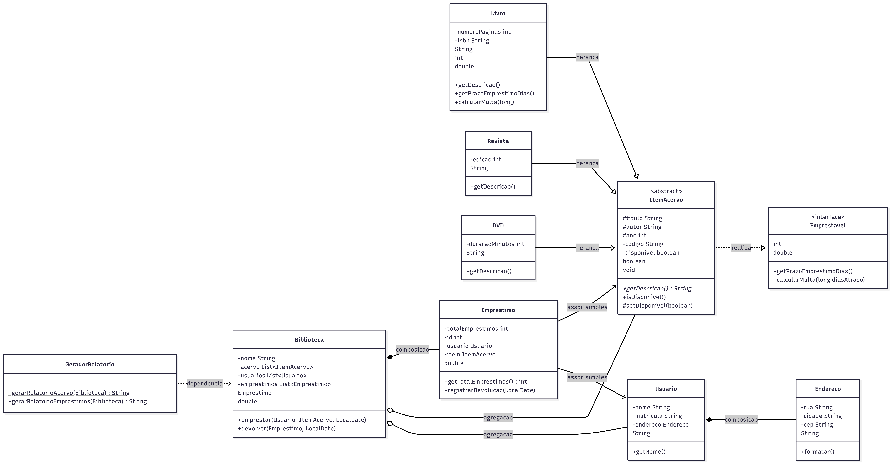
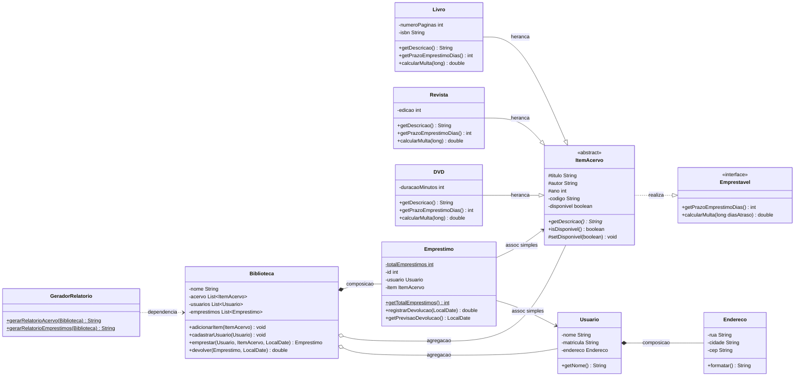

# Diagrama de Classes — Sistema de Biblioteca

O diagrama abaixo representa **fielmente** o código-fonte entregue em `src/biblioteca/`.
Ele está escrito em [Mermaid](https://mermaid.js.org/), que é renderizado
automaticamente pelo GitHub. Para editar/visualizar fora do GitHub, cole o
código em <https://mermaid.live>.

## Imagem do diagrama

## Legenda das relações

| Notação | Significado | Exemplo no projeto |
|---------|-------------|--------------------|
| `..|>`  | Realização de interface | `ItemAcervo` realiza `Emprestavel` |
| `--|>`  | Herança (generalização) | `Livro`, `Revista`, `DVD` → `ItemAcervo` |
| `*--`   | **Composição** (parte morre com o todo) | `Usuario` ◆ `Endereco`; `Biblioteca` ◆ `Emprestimo` |
| `o--`   | **Agregação** (parte vive sem o todo) | `Biblioteca` ◇ `Usuario`; `Biblioteca` ◇ `ItemAcervo` |
| `-->`   | **Associação simples** | `Emprestimo` → `Usuario`; `Emprestimo` → `ItemAcervo` |
| `..>`   | **Dependência** (uso por parâmetro) | `GeradorRelatorio` ⇢ `Biblioteca` |

> Nos membros: `*` = método abstrato, `$` = membro estático,
> `#` = `protected`, `-` = `private`, `+` = `public`.

## Diagrama

